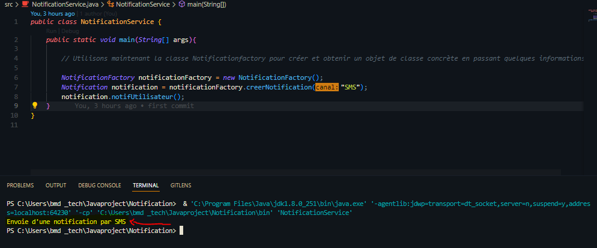

Dans le diagramme de classes ci-dessus, nous avons une interface appelée Notification, et trois classes concrètes implémentent l'interface Notification. Une classe NotificationFactory est créée pour obtenir un objet Notification.

Utilisons maintenant la classe Notificationfactory pour créer et obtenir un objet de classe concrète en passant quelques informations. 

## Résultat : Envoie d'une notification par SMS
