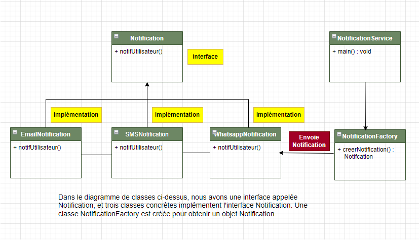

Dans le diagramme de classes ci-dessus, nous avons une interface appelée Notification, et trois classes concrètes implémentent l'interface Notification. Une classe NotificationFactory est créée pour obtenir un objet Notification.

### Résultat : Sending an SMS notification
